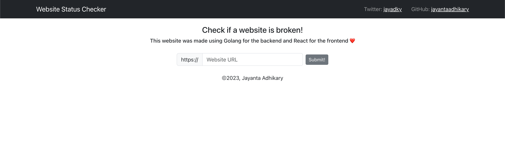
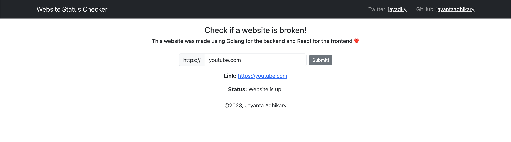

# Fullstack application to check if a website is running or not.

This is a fullstack application to check if a website is running or not. It is built using Golang in the server side and React in the client side. This allows the user to search for a website and check if it is running or not.

## Todo List

- [x] Create the server side application using Golang
- [x] Create the client side application using React
- [x] Make the UI look clean and simple
- [ ] Deploy the server side application to Heroku
- [ ] Update the GET and POST requests to use the Heroku URL instead of the localhost URL
- [ ] Deploy the client side application to Netlify

Screenshot of the application:

